# Chess Tournament Manager

## Description
A Python application for managing chess tournaments following the Swiss tournament system. Built with a MVC architecture, this application allows tournament organizers to manage players, tournaments, rounds and generate various reports.

## Features
- Tournament Management:
  - Create new tournaments
  - Set tournament parameters (rounds, time control, description)
  - Track tournament progress
  - Generate Swiss system pairings
- Player Management:
  - Add new players
  - List players registered
- Match Management:
  - Record match results
  - Update player scores
- Reports Generation:
  - Players list (alphabetically)
  - Tournament list and details
  - Tournament players
  - Tournament rounds and matches
- Display Options:
  - Console text format
  - HTML formatted output

## Installation

### Prerequisites
- Python 3.8 or higher
- pip (Python package installer)

### Setup
1. Clone the repository:
```bash
git clone https://github.com/fkruklyaramis/OC/tree/main/projet4
cd projet4
```

2. Create a virtual environment:
```bash
python -m venv env
source env/bin/activate  # For macOS/Linux
```

3. Install required packages:
```bash
pip install -r requirements.txt
```

## Project Structure

```mermaid
graph TD
    A[projet4] --> B[controllers]
    A --> C[models]
    A --> D[views]
    A --> E[templates]
    A --> F[data]
    A --> G[main.py]

    B --> B1[interface_controller.py]
    B --> B2[player_controller.py]
    B --> B3[report_controller.py]
    B --> B4[tournament_controller.py]
    B --> B5[match_controller.py]
    B --> B6[round_controller.py]

    C --> C1[data_manager_model.py]
    C --> C2[player_model.py]
    C --> C3[tournament_model.py]
    C --> C4[match_model.py]
    C --> C5[round_model.py]

    D --> D1[interface_view.py]
    D --> D2[player_view.py]
    D --> D3[report_view.py]
    D --> D4[tournament_view.py]
    D --> D5[match_view.py]
    D --> D6[round_view.py]

    E --> E1[players_list.html]
    E --> E2[tournaments_list.html]
    E --> E3[tournament_details.html]
    E --> E4[tournament_rounds.html]
    E --> E5[tournament_players.html]

    F --> F1[players.json]
    F --> F2[tournaments.json]

    style A fill:#f9f,stroke:#333,stroke-width:2px
    style B fill:#bbf,stroke:#333
    style C fill:#bfb,stroke:#333
    style D fill:#fbb,stroke:#333
    style E fill:#ffb,stroke:#333
    style F fill:#bff,stroke:#333
```


## Usage

### Starting the Application
```bash
python main.py
```

### Main Menu Options
1. Create Tournament
   - Enter tournament details
   - Add players
   - Start rounds
   - Record match results

2. Add Player
   - Enter player name
   - Chess ID
   - Birth date

3. View Reports
   - All players (alphabetically)
   - All tournaments
   - Tournament details by name
   - Tournament players
   - Tournament rounds and matches

4. Exit

## Data Storage
The application uses JSON files for data persistence:
- `players.json`: Stores player information
- `tournaments.json`: Stores tournament data, including rounds and matches

## Dependencies
- Python 3.8+
- Jinja2: Template engine for HTML output
- Rich: Console text formatting and styling
- flake8-html: Generate PEP 8 validation HTML file

## Architecture
This project follows the MVC (Model-View-Controller) pattern:
- **Models**: Handle data structure and business logic
- **Views**: Manage user interface and data presentation
- **Controllers**: Process user input and coordinate between models and views

## Development
- Written in Python
- Follows PEP 8 style guide
- Implements MVC architecture
- Uses JSON for data persistence
- HTML templates for report generation

## Code Quality
The project follows PEP 8 style guide and passes Flake8 checks without errors. 
View the [Flake8 HTML Report](flake8_report/index.html) for details.

```bash
# Generate Flake8 HTML report
flake8 --format=html --htmldir=flake8_report ./controllers/*.py ./models/*.py ./views/*.py main.py
```